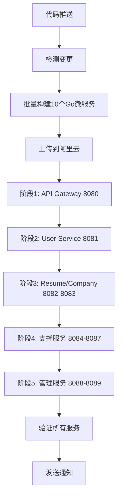

# Zervigo Future 微服务CI/CD部署套件

**版本**: 1.0.0  
**更新时间**: 2025年10月18日  
**部署目标**: 阿里云服务器 47.115.168.107  
**服务数量**: 10个Go微服务 (8080-8089)

## 📋 目录结构

```
zervigo_future_CICD/
├── README.md                           # 本文档
├── workflows/                          # GitHub Actions工作流
│   └── zervigo-future-deploy.yml      # CI/CD部署流水线
├── scripts/                            # 部署脚本
│   ├── microservice-deployment-manager.sh    # 微服务部署管理器
│   ├── verify-microservice-deployment.sh     # 部署验证脚本
│   └── quick-deploy.sh                       # 快速部署脚本
├── docs/                               # 文档
│   ├── ALIBABA_MICROSERVICE_DEPLOYMENT_GUIDE.md    # 详细部署指南
│   ├── ZERVIGO_FUTURE_CICD_IMPLEMENTATION_SUMMARY.md  # 实现总结
│   └── QUICK_REFERENCE_ALIBABA_DEPLOYMENT.md       # 快速参考
└── configs/                            # 配置文件目录
    └── (配置文件将在此处)
```

## 🎯 快速开始

### 方式1: 自动部署 (推荐)

1. **将workflow文件放到项目根目录**:
```bash
cp workflows/zervigo-future-deploy.yml ../.github/workflows/
```

2. **配置GitHub Secrets**:
在GitHub仓库设置中添加以下Secrets:
- `ALIBABA_SERVER_IP`: 47.115.168.107
- `ALIBABA_SERVER_USER`: root
- `ALIBABA_SSH_PRIVATE_KEY`: SSH私钥内容
- `ALIBABA_DEPLOY_PATH`: /opt/services (可选)

3. **推送代码触发部署**:
```bash
git add .
git commit -m "Update microservices"
git push origin main
```

### 方式2: 手动部署

1. **上传脚本到服务器**:
```bash
scp scripts/*.sh root@47.115.168.107:/opt/services/scripts/
```

2. **SSH到服务器执行部署**:
```bash
ssh root@47.115.168.107
cd /opt/services
chmod +x scripts/*.sh
./scripts/microservice-deployment-manager.sh deploy-all
```

## 📊 部署的微服务列表

| 端口 | 服务名称 | 说明 | 启动时序 |
|------|---------|------|---------|
| 8080 | API Gateway | 统一API入口 | 阶段1: 网关层 |
| 8081 | User Service | 用户认证、权限管理 | 阶段2: 认证层 |
| 8082 | Resume Service | 简历管理 | 阶段3: 核心业务 |
| 8083 | Company Service | 企业管理 | 阶段3: 核心业务 |
| 8084 | Notification Service | 通知服务 | 阶段4: 支撑服务 |
| 8085 | Template Service | 模板服务 | 阶段4: 支撑服务 |
| 8086 | Statistics Service | 统计服务 | 阶段4: 支撑服务 |
| 8087 | Banner Service | 横幅服务 | 阶段4: 支撑服务 |
| 8088 | Dev Team Service | 开发团队管理 | 阶段5: 管理服务 |
| 8089 | Job Service | 职位管理 | 阶段5: 管理服务 |

## 🏗️ 预部署服务 (无需CI/CD部署)

以下服务已在阿里云服务器上运行，**CI/CD流水线不会重复部署**：

| 端口 | 服务 | 状态 | 说明 |
|------|------|------|------|
| 3306 | MySQL | ✅ 运行中 | migration-mysql容器 |
| 5432 | PostgreSQL | ✅ 运行中 | migration-postgres容器 |
| 6379 | Redis | ✅ 运行中 | migration-redis容器 |
| 27017 | MongoDB | ✅ 运行中 | migration-mongodb容器 |
| 8100 | AI Service | ✅ 运行中 | Python服务 |

## 🚀 部署流程

### CI/CD自动部署流程



### 时序化部署说明

1. **网关层** (8080): 先启动API Gateway，作为统一入口，等待10秒
2. **认证层** (8081): 启动User Service，提供认证基础，等待10秒
3. **核心业务层** (8082-8083): 启动Resume/Company Service，等待5秒
4. **支撑服务层** (8084-8087): 启动4个支撑服务，等待3秒
5. **管理服务层** (8088-8089): 启动管理服务，等待3秒

每个阶段都会进行健康检查，确保服务正常启动后再进入下一阶段。

## 📝 使用脚本说明

### 1. microservice-deployment-manager.sh

**功能**: 完整的微服务部署管理器

**使用方法**:
```bash
./scripts/microservice-deployment-manager.sh [命令]

命令:
  deploy-all      # 部署所有微服务 (按正确时序)
  deploy-infra    # 仅部署基础设施层
  deploy-gateway  # 仅部署网关层
  deploy-auth     # 仅部署认证授权层
  deploy-business # 仅部署业务服务层
  deploy-ai       # 仅部署AI服务层
  stop            # 停止所有服务
  restart         # 重启所有服务
  status          # 显示服务状态
  verify          # 验证部署
```

### 2. verify-microservice-deployment.sh

**功能**: 验证所有微服务的部署状态

**使用方法**:
```bash
./scripts/verify-microservice-deployment.sh

# 会检查:
# - Docker容器状态
# - 微服务健康检查
# - 数据库连接
# - 端口监听
# - 服务发现
# - 系统资源
# - 生成部署报告
```

### 3. quick-deploy.sh

**功能**: 快速部署所有微服务到阿里云

**使用方法**:
```bash
./scripts/quick-deploy.sh

# 会自动:
# - 检查SSH连接
# - 上传项目文件
# - 部署基础设施
# - 部署微服务
# - 验证部署
# - 显示部署信息
```

## 🔍 验证部署

### 快速健康检查

```bash
# 检查所有微服务
for port in 8080 8081 8082 8083 8084 8085 8086 8087 8088 8089; do
    curl -f http://47.115.168.107:$port/health && echo "✅ Port $port OK" || echo "❌ Port $port Failed"
done

# 检查AI服务 (预部署)
curl http://47.115.168.107:8100/health

# 检查数据库容器
ssh root@47.115.168.107 'podman ps | grep migration'
```

### 详细验证

```bash
# 使用验证脚本
./scripts/verify-microservice-deployment.sh

# 或在服务器上执行
ssh root@47.115.168.107 'cd /opt/services && ./scripts/verify-microservice-deployment.sh'
```

## 🆘 故障排除

### 常见问题

#### 1. 服务启动失败
```bash
# 查看日志
ssh root@47.115.168.107 'tail -100 /opt/services/logs/[service-name].log'

# 检查端口占用
ssh root@47.115.168.107 'netstat -tlnp | grep [port]'

# 检查进程
ssh root@47.115.168.107 'ps aux | grep [service-name]'
```

#### 2. 数据库连接失败
```bash
# 检查数据库容器
ssh root@47.115.168.107 'podman ps | grep migration'

# 测试数据库连接
ssh root@47.115.168.107 'podman exec migration-mysql mysql -uroot -pJobFirst2025!MySQL -e "SELECT 1;"'
```

#### 3. 健康检查失败
```bash
# 重启服务
ssh root@47.115.168.107 'pkill -f user-service'
ssh root@47.115.168.107 'cd /opt/services/backend/bin && nohup ./user-service > ../../logs/user-service.log 2>&1 &'

# 验证健康检查
curl http://47.115.168.107:8081/health
```

## 🔒 安全配置

### 数据库密码

根据[服务器现状报告](../ALIYUN_SERVER_STATUS_REPORT_20251018.md)，使用以下强密码：

- **PostgreSQL**: `JobFirst2025!PG`
- **MySQL**: `JobFirst2025!MySQL`
- **MongoDB**: `JobFirst2025!Mongo`
- **Redis**: `JobFirst2025!Redis`

### 防火墙配置

```bash
# 开放微服务端口
sudo ufw allow 8080:8089/tcp
sudo ufw allow 8100/tcp

# 开放数据库端口 (内网访问)
sudo ufw allow from 172.20.0.0/16 to any port 3306
sudo ufw allow from 172.20.0.0/16 to any port 5432
sudo ufw allow from 172.20.0.0/16 to any port 6379
sudo ufw allow from 172.20.0.0/16 to any port 27017
```

## 📚 文档索引

- **[详细部署指南](docs/ALIBABA_MICROSERVICE_DEPLOYMENT_GUIDE.md)**: 完整的手动部署步骤和说明
- **[实现总结](docs/ZERVIGO_FUTURE_CICD_IMPLEMENTATION_SUMMARY.md)**: CI/CD实现的详细总结
- **[快速参考](docs/QUICK_REFERENCE_ALIBABA_DEPLOYMENT.md)**: 常用命令和快速查询

## 🔗 相关链接

- **服务器**: http://47.115.168.107
- **API Gateway**: http://47.115.168.107:8080
- **User Service**: http://47.115.168.107:8081
- **AI Service**: http://47.115.168.107:8100

## 📞 技术支持

如遇到问题，请查看：
1. [故障排除指南](docs/ALIBABA_MICROSERVICE_DEPLOYMENT_GUIDE.md#故障排除)
2. [服务器现状报告](../ALIYUN_SERVER_STATUS_REPORT_20251018.md)
3. 服务器日志: `/opt/services/logs/`

## 📈 版本历史

- **v1.0.0** (2025-10-18)
  - 初始版本
  - 支持10个Go微服务的CI/CD部署
  - 排除数据库和AI服务部署
  - 完整的时序化部署流程
  - 健康检查和验证机制

---

**维护者**: AI Assistant  
**最后更新**: 2025-10-18  
**License**: MIT
