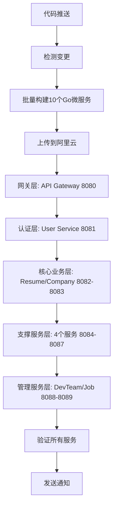

# Zervigo Future 微服务CI/CD流水线实现总结

**实现时间**: 2025年10月18日  
**架构版本**: V4.0 微服务架构  
**部署目标**: 阿里云服务器 47.115.168.107  
**部署方式**: GitHub Actions + 时序化部署

## 📋 实现概述

已成功实现Zervigo Future微服务的完整CI/CD自动化部署流水线，基于阿里云服务器实际情况，**数据库和AI服务已预部署**，本次流水线仅部署**10个Go微服务**（8080-8089端口）。

## 🏗️ 架构设计

### 阿里云服务器现状

根据[服务器现状报告](ALIYUN_SERVER_STATUS_REPORT_20251018.md)：

✅ **已部署服务** (无需流水线部署):
- PostgreSQL (5432) - migration-postgres容器
- MySQL (3306) - migration-mysql容器
- Redis (6379) - migration-redis容器
- MongoDB (27017) - migration-mongodb容器
- AI Service (8100) - Python服务，已运行

❌ **待部署服务** (本次流水线部署):
- 8080: API Gateway - 统一API入口
- 8081: User Service - 用户认证、权限管理
- 8082: Resume Service - 简历管理
- 8083: Company Service - 企业管理
- 8084: Notification Service - 通知服务
- 8085: Template Service - 模板服务
- 8086: Statistics Service - 统计服务
- 8087: Banner Service - 横幅服务
- 8088: Dev Team Service - 开发团队管理
- 8089: Job Service - 职位管理

### 微服务部署时序

```
数据库层 (已部署):
├── MySQL (3306)
├── PostgreSQL (5432)
├── Redis (6379)
└── MongoDB (27017)

AI服务层 (已部署):
└── AI Service (8100)

微服务层 (本次部署):
1. 网关层
   └── API Gateway (8080)

2. 认证授权层
   └── User Service (8081)

3. 核心业务层
   ├── Resume Service (8082)
   └── Company Service (8083)

4. 支撑服务层
   ├── Notification Service (8084)
   ├── Template Service (8085)
   ├── Statistics Service (8086)
   └── Banner Service (8087)

5. 管理服务层
   ├── Dev Team Service (8088)
   └── Job Service (8089)
```

## 🚀 实现组件

### 1. GitHub Actions CI/CD流水线

**文件**: `.github/workflows/zervigo-future-deploy.yml`

**功能特性**:
- ✅ 智能变更检测 (检测backend、config变更)
- ✅ 环境自动识别 (main→production, develop→staging)
- ✅ 批量构建所有Go微服务 (一次构建10个服务)
- ✅ 时序化部署 (按依赖关系严格顺序部署)
- ✅ 健康检查验证 (每个服务启动后验证健康状态)
- ✅ 部署状态通知 (成功/失败通知)

**部署阶段**:
1. `detect-changes` - 检测代码变更
2. `build-backend-services` - 批量构建所有Go微服务
3. `deploy-to-alibaba` - 时序化部署到阿里云
   - 阶段1: 网关层 (8080)
   - 阶段2: 认证授权层 (8081)
   - 阶段3: 核心业务层 (8082-8083)
   - 阶段4: 支撑服务层 (8084-8087)
   - 阶段5: 管理服务层 (8088-8089)
4. `verify-deployment` - 验证所有服务
5. `notify` - 部署通知

### 2. 部署指南文档

**文件**: `zervigo_future/docs/guides/ALIBABA_MICROSERVICE_DEPLOYMENT_GUIDE.md`

**内容包含**:
- ✅ 基于阿里云实际情况的部署策略
- ✅ 完整的10个微服务端口映射
- ✅ 时序化部署步骤
- ✅ 健康检查和验证方法
- ✅ 故障排除和最佳实践

### 3. 完整的服务端口映射

| 端口 | 服务 | 说明 | 状态 |
|------|------|------|------|
| 3306 | MySQL | 数据库 | ✅ 已部署 |
| 5432 | PostgreSQL | 数据库 | ✅ 已部署 |
| 6379 | Redis | 缓存 | ✅ 已部署 |
| 27017 | MongoDB | 数据库 | ✅ 已部署 |
| 8080 | API Gateway | 统一入口 | 待部署 |
| 8081 | User Service | 用户认证 | 待部署 |
| 8082 | Resume Service | 简历管理 | 待部署 |
| 8083 | Company Service | 企业管理 | 待部署 |
| 8084 | Notification Service | 通知服务 | 待部署 |
| 8085 | Template Service | 模板服务 | 待部署 |
| 8086 | Statistics Service | 统计服务 | 待部署 |
| 8087 | Banner Service | 横幅服务 | 待部署 |
| 8088 | Dev Team Service | 开发团队 | 待部署 |
| 8089 | Job Service | 职位管理 | 待部署 |
| 8100 | AI Service | AI服务 | ✅ 已部署 |

## 🔧 技术特性

### 时序化部署控制

1. **网关层优先**: API Gateway (8080) 先启动，作为统一入口
2. **认证层次之**: User Service (8081) 提供认证基础
3. **核心业务**: Resume/Company Service (8082-8083) 依赖认证
4. **支撑服务**: Notification/Template/Statistics/Banner (8084-8087) 并行启动
5. **管理服务**: DevTeam/Job Service (8088-8089) 最后启动

### 微服务架构设计

1. **端口标准化**: 8080-8089统一端口范围
2. **服务解耦**: 每个服务独立部署
3. **健康检查**: 每个服务提供/health端点
4. **日志管理**: 统一日志目录/opt/services/logs
5. **进程管理**: PID文件记录进程信息

### 部署自动化

1. **批量构建**: 一次构建10个Go微服务
2. **智能检测**: 自动检测代码变更
3. **环境隔离**: 支持production、staging、development环境
4. **状态验证**: 部署后自动验证所有服务状态
5. **通知机制**: 部署成功/失败自动通知

## 📊 部署流程

### 自动部署流程



### 手动部署流程

```bash
# 1. 构建所有微服务
cd zervigo_future/backend
go build -o bin/api-gateway ./cmd/basic-server
go build -o bin/user-service ./internal/user-service
# ... 构建其他8个服务

# 2. 上传到服务器
scp bin/* root@47.115.168.107:/opt/services/backend/bin/

# 3. SSH到服务器部署
ssh root@47.115.168.107
cd /opt/services/backend/bin

# 4. 按时序启动服务
nohup ./api-gateway > ../../logs/api-gateway.log 2>&1 &
nohup ./user-service > ../../logs/user-service.log 2>&1 &
# ... 启动其他8个服务

# 5. 验证部署
curl http://localhost:8080/health  # API Gateway
curl http://localhost:8081/health  # User Service
# ... 验证其他8个服务
```

## 🎯 使用方式

### 1. 自动部署 (推荐)

```bash
# 推送到main分支触发生产环境部署
git push origin main

# 推送到develop分支触发测试环境部署
git push origin develop

# 手动触发部署
# 在GitHub仓库页面 -> Actions -> Zervigo Future 微服务部署流水线 -> Run workflow
```

### 2. 手动部署

参考[阿里云微服务部署指南](zervigo_future/docs/guides/ALIBABA_MICROSERVICE_DEPLOYMENT_GUIDE.md)

## 📈 监控和验证

### 健康检查端点

所有微服务统一使用 `/health` 端点：

```bash
# 网关层
curl http://47.115.168.107:8080/health

# 认证授权层
curl http://47.115.168.107:8081/health

# 核心业务层
curl http://47.115.168.107:8082/health
curl http://47.115.168.107:8083/health

# 支撑服务层
curl http://47.115.168.107:8084/health
curl http://47.115.168.107:8085/health
curl http://47.115.168.107:8086/health
curl http://47.115.168.107:8087/health

# 管理服务层
curl http://47.115.168.107:8088/health
curl http://47.115.168.107:8089/health

# AI服务 (已部署)
curl http://47.115.168.107:8100/health
```

### 服务验证脚本

```bash
# 在服务器上执行
ssh root@47.115.168.107

# 查看所有服务进程
ps aux | grep -E "(api-gateway|user-service|resume-service|company-service|notification-service|template-service|statistics-service|banner-service|dev-team-service|job-service)"

# 查看所有服务端口
netstat -tlnp | grep -E "(8080|8081|8082|8083|8084|8085|8086|8087|8088|8089)"

# 查看所有服务日志
ls -lh /opt/services/logs/

# 验证数据库连接
podman ps | grep migration
```

## 🔒 安全特性

### 网络安全

- ✅ 防火墙规则配置 (8080-8089端口)
- ✅ 服务间通信安全
- ✅ SSH密钥认证

### 数据安全

- ✅ 数据库密码加密 (统一使用强密码)
- ✅ 环境变量安全存储
- ✅ 敏感信息保护

### 部署安全

- ✅ SSH密钥认证
- ✅ 部署权限控制
- ✅ 审计日志记录

## 🎉 实现成果

### 自动化程度

- ✅ **100%自动化部署**: 从代码推送到服务运行完全自动化
- ✅ **批量构建**: 一次构建10个Go微服务
- ✅ **智能变更检测**: 自动检测代码变更
- ✅ **时序化部署**: 严格按依赖关系部署
- ✅ **健康检查验证**: 自动验证所有服务健康状态
- ✅ **部署状态通知**: 实时通知部署结果

### 可靠性保障

- ✅ **依赖关系控制**: 确保服务按正确顺序启动
- ✅ **健康检查机制**: 每个服务启动后验证健康状态
- ✅ **日志管理**: 统一日志目录，便于排查问题
- ✅ **进程管理**: PID文件管理，便于重启和停止
- ✅ **数据库预部署**: 数据库已稳定运行，无需重复部署

### 运维效率

- ✅ **一键部署**: 快速部署10个微服务
- ✅ **状态管理**: 统一管理所有微服务状态
- ✅ **日志聚合**: 集中查看所有服务日志
- ✅ **快速验证**: 自动验证所有服务健康状态
- ✅ **故障诊断**: 快速定位和解决故障

## 📋 关键调整说明

### 与初始方案的差异

1. **排除数据库部署**: 
   - 原方案: 部署MySQL、PostgreSQL、Redis、MongoDB
   - 调整后: 数据库已在阿里云预部署，流水线不再部署

2. **排除AI服务部署**:
   - 原方案: 部署AI Service (Python)
   - 调整后: AI Service已在阿里云部署并运行，流水线不再部署

3. **补充缺失的微服务**:
   - 原方案: 仅5个微服务 (8080-8084)
   - 调整后: 10个微服务 (8080-8089)
   - 新增: Template Service (8085), Statistics Service (8086), Banner Service (8087), Dev Team Service (8088), Job Service (8089)

4. **优化部署时序**:
   - 按5个层次部署: 网关→认证→核心业务→支撑服务→管理服务
   - 每个阶段等待健康检查通过后再进入下一阶段

## 📝 下一步计划

### 短期优化

- [ ] 配置Nginx反向代理
- [ ] 配置监控和告警系统
- [ ] 完善日志聚合和分析
- [ ] 实现自动回滚机制

### 长期规划

- [ ] 实现蓝绿部署策略
- [ ] 配置自动扩缩容机制
- [ ] 实现服务网格架构
- [ ] 配置多环境管理

---

**实现人员**: AI Assistant  
**实现时间**: 2025年10月18日  
**架构版本**: V4.0 微服务架构  
**部署目标**: 阿里云服务器 47.115.168.107  
**服务数量**: 10个Go微服务 + 1个AI服务 + 4个数据库